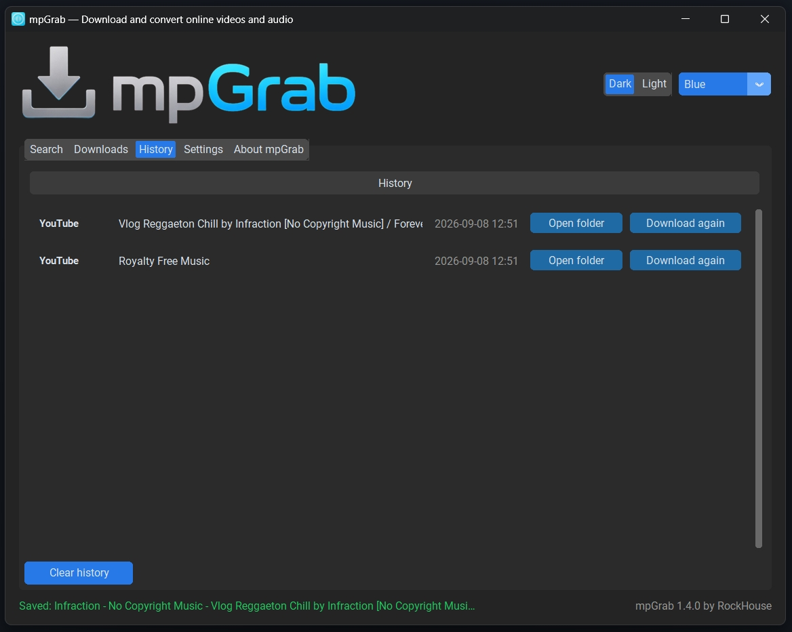
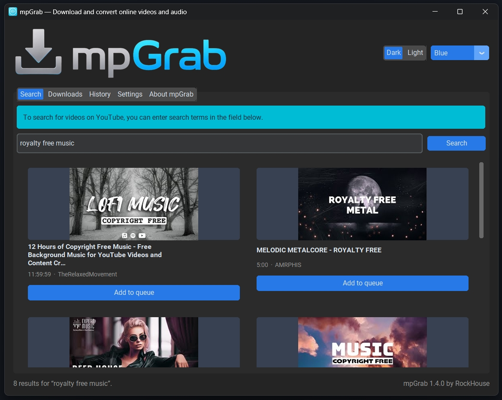
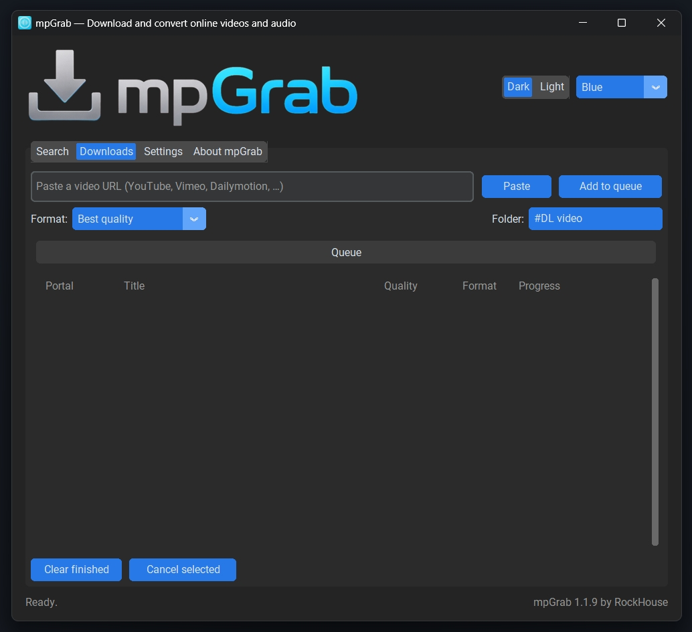
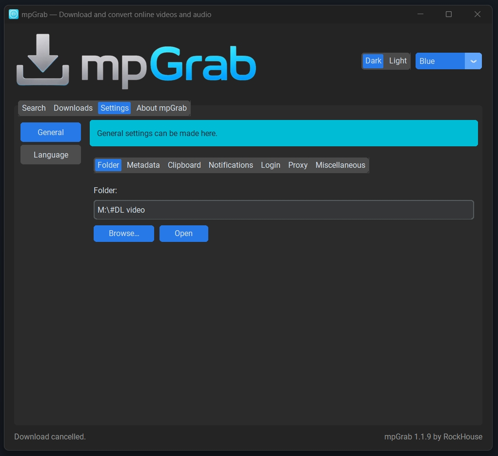

# mpGrab

**mpGrab** is a free, friendly video downloader and converter for Windows by [RockHouse](https://ko-fi.com/rockhouse).
Paste a link, pick a format, done - powered by the actively maintained **yt-dlp** engine.

## Screenshots

| | |
|---|---|
|  |  |
| *Search YouTube and queue results* | *Queue with Portal, Title, Quality, Format and Progress* |
|  |  |
| *Paste a link, pick a format and folder* | *Dark & light themes with accent colors* |

## Download

Grab the latest installer from the [Releases page](https://github.com/kawah24/mpGrab/releases):

- `mpGrab-<version>-setup.exe` - per-user Windows installer (no admin needed, Start-menu + desktop shortcuts, uninstaller)
- `mpGrab-<version>-win64.zip` - portable zip, just unzip and run

## Getting started

1. Install and start mpGrab.
2. Paste a video link (mpGrab can even watch your clipboard) or use the built-in **Search** tab.
3. Pick a format - Best quality, 1080p / 720p / 480p, MP3 or M4A - and a folder.
4. Click **Add to queue** and watch the queue: Portal, Title, Quality, Format and live progress.

## Highlights

- **Search YouTube** directly and queue results with thumbnails
- **Formats**: Best quality, 1080p / 720p / 480p, MP3 192 kbit/s, M4A
- **Clean file names**: `Artist - Title` with the thumbnail embedded as cover art
- **13 interface languages** - English, Deutsch, Türkçe, Español, Français, Italiano, Português, Русский, العربية, 中文, 日本語, 한국어, Nederlands
- **Dark & light themes** with four accent colors - persisted between runs
- **Clipboard monitoring**, browser-cookie login for age-restricted videos, proxy support, system-tray minimize
- **Update check** - mpGrab tells you (in-app) when a new version is published here

## Tips & troubleshooting

- **"Sign in to confirm you're not a bot"?** Open Settings → Login and import cookies from your browser (Chrome, Firefox, Edge, ...).
- **Some formats are disabled?** Install [ffmpeg](https://ffmpeg.org) and restart mpGrab - it unlocks best-quality merging and MP3/M4A conversion.
- **Where are my files?** In your chosen folder (Settings → Folder, or the folder picker right next to the format selector).
- mpGrab checks GitHub on startup and shows a banner when a new version is available - you can turn that off in Settings.

## Feedback & support

Found a bug or have an idea? [Open an issue](https://github.com/kawah24/mpGrab/issues) or reach [RockHouse](https://ko-fi.com/rockhouse) on Ko-fi - and if mpGrab saves you time, a coffee is always appreciated. ☕

## Legal

mpGrab is a download manager for personal use. Please respect the rights of content creators and the terms of service of the platforms you download from - mpGrab is not affiliated with YouTube or any other platform.
